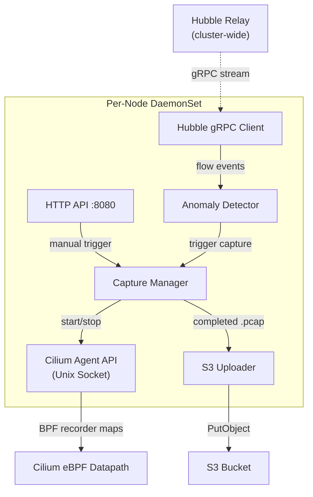

# Cilium Flight Recorder

A Go-based DaemonSet that monitors Cilium/Hubble flows for anomalies and automatically triggers targeted PCAP captures via Cilium's BPF recorder. Captured PCAPs are uploaded to S3 for post-incident analysis.

## Architecture



### Anomaly Triggers

| Trigger | What it detects | Flow field |
|---|---|---|
| **HTTP 5xx** | Configurable status codes (default: 500, 502, 503, 504) | `flow.l7.http.code` |
| **Packet drops** | Policy denies, conntrack issues, BPF errors | `flow.verdict == DROPPED` |
| **DNS failures** | NXDOMAIN, SERVFAIL, REFUSED | `flow.l7.dns.rcode` |
| **Latency spikes** | P99 latency exceeding a threshold (sliding window) | `flow.l7.latency_ns` |

Each trigger has a per-tuple cooldown to prevent capture storms.

### Detection Modes

HTTP errors, packet drops, and DNS failures all support two modes:

| Mode | When it fires | Best for |
|---|---|---|
| `immediate` (default) | On every matching flow | Dev/staging; rare, actionable events |
| `rate` | When the error rate exceeds a threshold over a rolling window | Production; filtering transient blips |

- **HTTP errors (`rate`)** — keyed by destination IP:port. Fires when `errors/total >= rateThreshold` and `total >= minEvents` within `windowSeconds`.
- **Drops (`rate`)** — keyed by destination IP:port. Fires when drop count `>= minDrops` within `windowSeconds`.
- **DNS failures (`rate`)** — keyed by source IP (the client making queries). Fires when `failures/total >= rateThreshold` and `total >= minEvents` within `windowSeconds`.
- **Latency** — always uses a sliding window (P99 over `windowSize` samples).

In `rate` mode, captures are scoped to the aggregated key (e.g. "any source → dst IP:port") rather than a single src/dst pair, so the PCAP shows all traffic contributing to the anomaly.

### Data Flow

1. **Hubble Relay** streams L3/L4/L7 flow events cluster-wide via gRPC
2. **Anomaly Detector** evaluates each flow against configurable rules with rate limiting
3. **Capture Manager** calls the Cilium agent REST API to start/stop the BPF recorder
4. **S3 Uploader** pushes completed PCAPs with structured keys and metadata
5. **HTTP API** exposes manual triggers and a capture listing

## Project Structure

```
cilium-flight-recorder/
  cmd/
    recorder/main.go           # Production entrypoint
    mock-cilium/main.go        # Mock Cilium agent for local dev
    mock-hubble/main.go        # Mock Hubble Relay for local dev
  pkg/
    config/config.go           # YAML config loading with defaults
    watcher/hubble.go          # Hubble gRPC client with reconnection
    detector/anomaly.go        # Rule evaluation and cooldown
    detector/rate.go           # Rolling-window error rate tracking
    capture/recorder.go        # Cilium agent API interaction
    storage/s3.go              # S3 upload with IRSA support
    api/server.go              # HTTP API for manual triggers + listing
  helm/
    Chart.yaml                 # Helm chart metadata
    values.yaml                # Default values (fully commented)
    values-example.yaml        # Per-cluster overrides (example)
    templates/                 # DaemonSet, ConfigMap, RBAC, SA, Service
  scripts/
    test-local.sh              # Comprehensive local test suite
  testdata/
    config-local.yaml          # Config for Docker-based local dev (immediate)
    config-local-rate.yaml     # Config for exercising rate-based mode
  docker-compose.yaml          # Full local environment
  Dockerfile                   # Multi-target build (prod + mocks)
  Makefile
```

## Requirements

- Go 1.25+
- Docker / Docker Compose (for local development)
- Helm 3.x (for cluster deployment)
- Cilium 1.19+ with Hubble Relay (target cluster)

## Building

```bash
# Build all binaries locally (requires Go 1.25+)
make build

# Build Docker images
make docker-build

# Run unit tests
make test
```

## Configuration

All configuration is driven by the Helm chart values. `helm/values.yaml` documents every setting inline; `helm/values-example.yaml` is the example per-cluster overlay.

### Key Helm Values

| Value | Default | Description |
|---|---|---|
| `cluster.name` | `example-cluster` | Cluster identifier (embedded in S3 keys + metadata) |
| `image.repository` | `ghcr.io/vperez237/flight-recorder` | Container image (override for your registry) |
| `image.tag` | Chart `appVersion` | Image tag (override per deployment) |
| `s3.bucket` | `flight-recorder-pcaps` | Target S3 bucket |
| `s3.region` | `us-east-1` | AWS region |
| `s3.endpoint` | `""` | Custom S3 endpoint (MinIO/LocalStack) |
| `hubble.address` | `hubble-relay.kube-system.svc:4245` | Hubble Relay gRPC endpoint |
| `cilium.socketPath` | `/var/run/cilium/cilium.sock` | Node's Cilium agent socket |
| `cilium.bpfPath` | `/sys/fs/bpf` | Host BPF filesystem mount |
| `triggers.httpErrors.*` | see below | HTTP 5xx trigger |
| `triggers.drops.*` | see below | Packet drop trigger |
| `triggers.dnsFailures.*` | see below | DNS failure trigger |
| `triggers.latency.*` | see below | P99 latency trigger |
| `capture.defaultDurationSeconds` | `60` | PCAP duration for auto-captures |
| `capture.maxConcurrent` | `3` | Max concurrent captures per node |
| `capture.cooldownSeconds` | `300` | Per-tuple cooldown (prevents storms) |
| `serviceAccount.annotations` | IRSA role | Attach IRSA role ARN here |
| `resources` | 50m CPU / 128Mi req | Per-pod resource requests/limits |
| `tolerations` | `- operator: Exists` | Run on all nodes by default |
| `service.enabled` | `false` | Expose HTTP API as a ClusterIP Service |

### Trigger Values

Each trigger supports `mode: immediate` (fire on every match, default) or `mode: rate` (fire only when the error rate crosses a threshold over a rolling window):

```yaml
triggers:
  httpErrors:
    enabled: true
    statusCodes: [500, 502, 503, 504]
    mode: immediate              # or "rate"
    minEvents: 10                # rate mode: min samples per dst before evaluating
    rateThreshold: 0.05          # rate mode: 5% error rate
    windowSeconds: 60            # rate mode: rolling window size
  drops:
    enabled: true
    mode: immediate
    minDrops: 5                  # rate mode: min drops to same dst in window
    windowSeconds: 60
  dnsFailures:
    enabled: true
    rcodes: [NXDOMAIN, SERVFAIL, REFUSED]
    mode: immediate
    minEvents: 10
    rateThreshold: 0.10
    windowSeconds: 60
  latency:
    enabled: true
    thresholdMs: 2000            # P99 threshold
    windowSize: 100              # sliding window size (samples)
```

### Underlying YAML Config

Helm renders the settings above into a ConfigMap that the container mounts at `/etc/flight-recorder/config.yaml`. You normally don't touch this file directly, but its schema is defined by `pkg/config/config.go`. For local (non-Helm) development, `testdata/config-local.yaml` shows the full format.

## Local Development with Docker

Run the full stack locally with mocked dependencies:

```bash
# Start everything (builds + starts MinIO, mock Cilium, mock Hubble, flight-recorder)
make docker-up

# Tail logs — see anomaly detection firing in real time
make docker-logs

# Quick smoke test — trigger one manual capture
make docker-test

# Full test suite — exercises all features (~75 seconds, 25 tests)
make docker-test-all

# Restart with a clean slate after code changes
make docker-restart

# Stop and clean up
make docker-down
```

### Local Services

| Service | Purpose | URL |
|---|---|---|
| `flight-recorder` | The application under test | `http://localhost:8080` |
| `mock-hubble` | Generates fake flows: drops, HTTP 5xx, DNS NXDOMAIN, latency spikes | `localhost:4245` (gRPC) |
| `mock-cilium` | Simulates Cilium agent recorder API, writes dummy PCAPs | Unix socket |
| `minio` | S3-compatible storage for captured PCAPs | Console: `http://localhost:9001` |

MinIO credentials: `minioadmin` / `minioadmin`

### Test Suite

The test script (`scripts/test-local.sh`) validates:

| Test | What it verifies |
|---|---|
| Health check | `GET /health` returns 200 with `{status: ok}` |
| Auto-detection | All 4 trigger types fire: drops, HTTP 503, DNS NXDOMAIN, latency spikes |
| Manual capture | `POST /capture` completes end-to-end with correct metadata |
| Cooldown | Rate limiter prevents capture storms |
| S3 upload | PCAPs exist in MinIO with correct key structure |
| PCAP validity | Valid magic bytes, tcpdump-readable |
| Metadata fields | All fields present on every capture entry |
| Error handling | Invalid JSON returns 400 |

## Kubernetes Deployment (Helm)

The Flight Recorder is deployed exclusively via the Helm chart in `helm/`. No raw manifests are shipped — every knob is exposed as a Helm value.

### Quick Start

```bash
# Lint the chart (catches syntax + schema issues)
make helm-lint

# Render templates locally for review (no cluster access needed)
make helm-template

# Install or upgrade in the target cluster
make helm-install

# Diff before rolling out (requires the helm-diff plugin)
make helm-diff

# Uninstall
make helm-uninstall
```

Equivalent `helm` invocation used by the Makefile:

```bash
helm upgrade --install flight-recorder ./helm \
  -n kube-system --create-namespace \
  -f helm/values-example.yaml
```

Override variables when invoking `make`:

```bash
make helm-install \
  HELM_RELEASE=flight-recorder \
  HELM_NAMESPACE=kube-system \
  HELM_VALUES=helm/values-prod.yaml
```

### Prerequisites

- Cilium 1.19+ with Hubble Relay enabled
- Cilium agent socket at `/var/run/cilium/cilium.sock`
- S3 bucket for PCAP storage
- IRSA ServiceAccount with `s3:PutObject` / `s3:GetObject` / `s3:ListBucket`

### Per-Cluster Values Files

`helm/values-example.yaml` is the reference overlay. Duplicate it per cluster (e.g. `helm/values-prod.yaml`) and change only the cluster-specific bits:

```yaml
cluster:
  name: my-prod-cluster
s3:
  bucket: flight-recorder-pcaps-prod
image:
  tag: v0.1.0
serviceAccount:
  annotations:
    eks.amazonaws.com/role-arn: arn:aws:iam::<account>:role/<role>
```

### Tuning Detection Per Environment

For production, `rate` mode with stricter thresholds avoids noise from transient errors:

```yaml
# helm/values-prod.yaml
triggers:
  httpErrors:
    mode: rate
    minEvents: 50          # only evaluate after 50 HTTP responses
    rateThreshold: 0.02    # 2% error rate sustained over the window
    windowSeconds: 120
  drops:
    mode: rate
    minDrops: 20           # require 20 drops to the same dst in the window
    windowSeconds: 60
  dnsFailures:
    mode: rate
    minEvents: 30
    rateThreshold: 0.05
    windowSeconds: 300
```

In dev, `immediate` mode is better — it surfaces every error so you can confirm the pipeline works.

### Rollout & Verification

```bash
kubectl -n kube-system rollout status ds/flight-recorder
kubectl -n kube-system logs -l app.kubernetes.io/name=flight-recorder -f

# Port-forward to one pod and test the API
POD=$(kubectl -n kube-system get pod -l app.kubernetes.io/name=flight-recorder -o name | head -1)
kubectl -n kube-system port-forward $POD 8080:8080 &
curl -s localhost:8080/captures | jq .
```

### Terraform (EKS)

The supporting AWS infrastructure (S3 bucket + IRSA role) is not included in this
repo. You'll need, at minimum:

- An S3 bucket (e.g. `flight-recorder-pcaps`) with a lifecycle rule that expires
  captured PCAPs after a retention window that matches your compliance needs.
- An IAM role with `s3:PutObject` on that bucket, bound to the pod's
  ServiceAccount via IRSA (EKS OIDC trust).

### Container Image Build

Build and push the production image to your own registry:

```bash
docker build --target flight-recorder \
  -t <your-registry>/flight-recorder:v0.1.0 .
docker push <your-registry>/flight-recorder:v0.1.0
```

Then point `image.repository` / `image.tag` at that image in your values file
and re-run `make helm-upgrade`.

## API

| Endpoint | Method | Description |
|---|---|---|
| `/capture` | POST | Trigger a manual PCAP capture |
| `/captures` | GET | List recent captures (paginated, newest first) |
| `/health` | GET | Liveness probe — 200 while the process is alive |
| `/ready` | GET | Readiness probe — 200 only while Hubble is connected, 503 otherwise |
| `/metrics` | GET | Prometheus metrics |

### POST /capture

```bash
curl -X POST http://localhost:8080/capture \
  -H "Content-Type: application/json" \
  -d '{
    "srcCIDR": "10.0.1.0/24",
    "dstCIDR": "10.0.2.0/24",
    "dstPort": 8080,
    "protocol": "TCP",
    "durationSeconds": 30
  }'
```

Body fields:

| Field | Type | Notes |
|---|---|---|
| `srcCIDR` | string | Source IP or CIDR. Empty means "any". |
| `dstCIDR` | string | Destination IP or CIDR. Empty means "any". |
| `dstPort` | number | 0–65535. 0 means "any". |
| `protocol` | string | `TCP`, `UDP`, `ICMPv4`, `ICMPv6`. Defaults to `TCP`. |
| `durationSeconds` | number | 0 means "use the server default". |

Responses:

- `202 Accepted` — capture started, body is `{"status":"accepted","message":"capture started"}`
- `400 Bad Request` — invalid JSON, bad IP/CIDR, out-of-range port, unsupported protocol, or negative duration. Body is `{"error":"…"}`.

### GET /captures

```bash
# Default: up to 100 newest entries
curl -s http://localhost:8080/captures | jq .

# Pagination: 5 per page, skip the 10 most recent
curl -s 'http://localhost:8080/captures?limit=5&offset=10' | jq .

# Filter by trigger
curl -s 'http://localhost:8080/captures?trigger=drop' | jq .
```

Query parameters:

| Parameter | Default | Notes |
|---|---|---|
| `limit` | `100` | Max items to return. Capped at 1000. |
| `offset` | `0` | Skip the N most recent entries. |
| `trigger` | *(none)* | One of `drop`, `http_error`, `dns_failure`, `latency`, `manual`. |

Response headers include `X-Total-Count`: the total after filtering, before pagination.

Response:

```json
[
  {
    "trigger": "drop",
    "reason": "packet dropped: POLICY_DENIED",
    "srcIP": "10.0.1.139",
    "dstIP": "10.0.2.203",
    "dstPort": 8080,
    "filePath": "/tmp/flight-recorder/20260326T140747Z_drop_10.0.1.139_10.0.2.203_8080.pcap",
    "startTime": "2026-03-26T14:07:47.984595636Z",
    "duration": "10.002643113s"
  }
]
```

### S3 Key Structure

```
s3://{bucket}/{cluster}/{node}/{YYYY}/{MM}/{DD}/{timestamp}_{trigger}_{src}_{dst}_{port}.pcap
```

Example: `flight-recorder-pcaps/example-cluster/ip-10-0-1-42/2026/03/26/20260326T140747Z_drop_10.0.1.139_10.0.2.203_8080.pcap`

The date is split into `YYYY/MM/DD` path segments so prefix-based S3 lifecycle
rules and operator browsing (`aws s3 ls bucket/cluster/node/2026/`) work without
parsing filenames.

Each object includes S3 metadata: trigger, reason, source/dest IPs, port, protocol, duration, node, cluster, timestamp.

## Viewing PCAPs

Download captures from MinIO (local) or S3 (production) and inspect them with standard tools:

```bash
# Download from local MinIO
mc alias set local http://localhost:9000 minioadmin minioadmin
mc ls local/flight-recorder-pcaps --recursive
mc cp local/flight-recorder-pcaps/<key> ./capture.pcap

# Quick summary
tcpdump -r capture.pcap -nn

# Open in Wireshark (GUI)
wireshark capture.pcap

# Filter with tshark (CLI)
tshark -r capture.pcap -Y "http"
tshark -r capture.pcap -q -z conv,tcp
```
